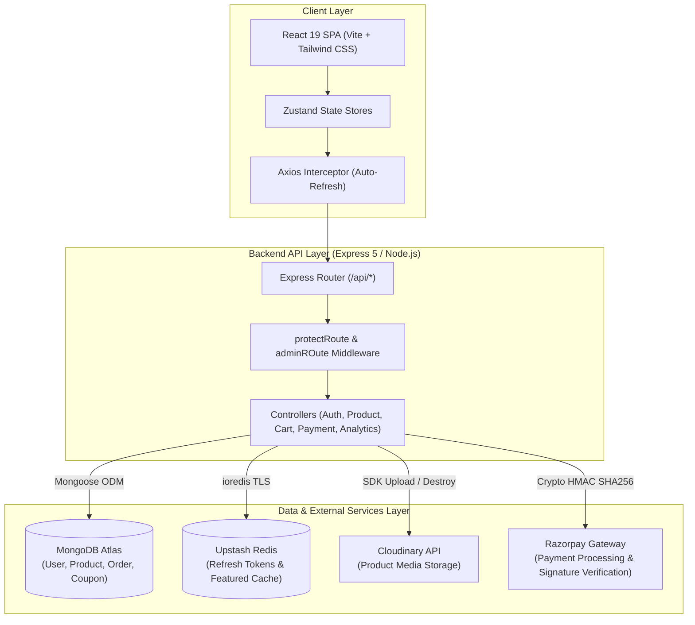
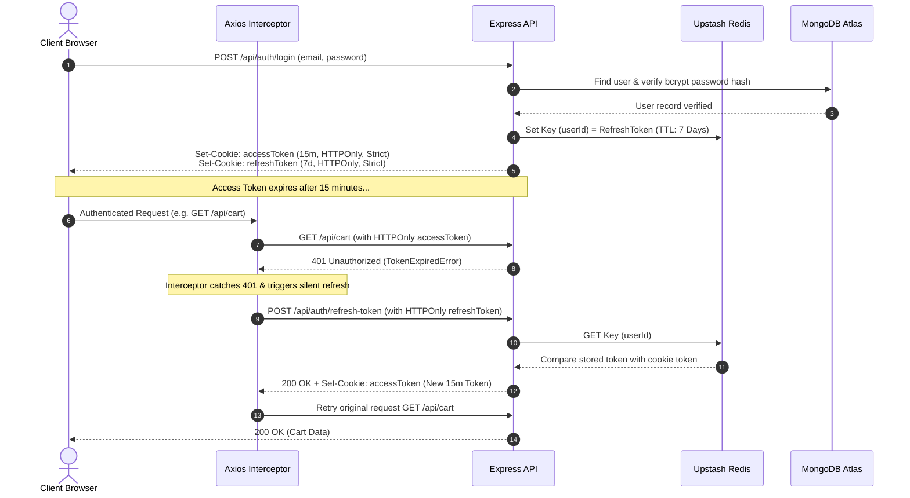
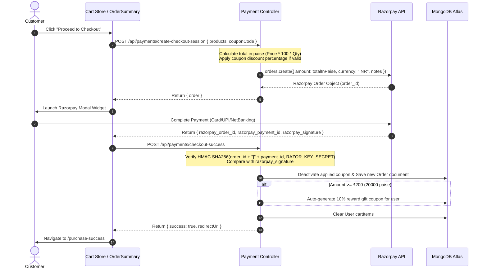
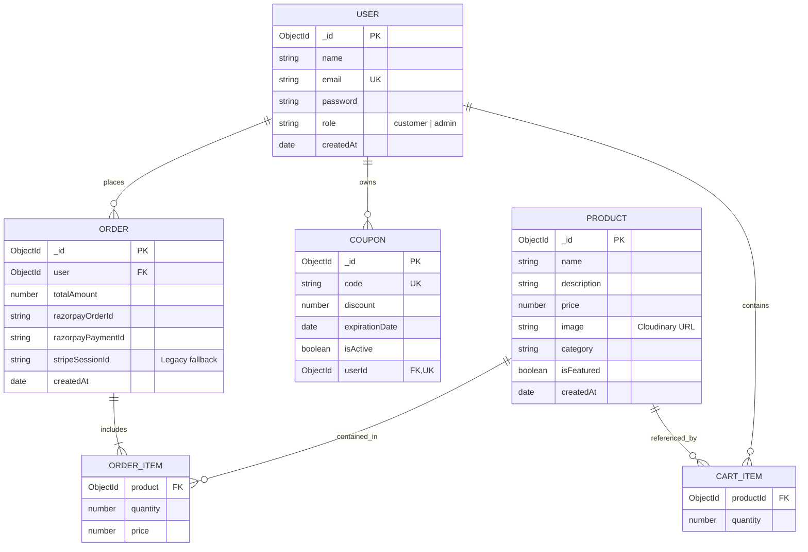

# 🛍️ Faishon E-Commerce — Production-Grade Full-Stack Platform

A high-performance, modern, full-stack fashion and apparel e-commerce web application engineered with **React 19**, **Vite**, **Express 5**, **MongoDB Atlas**, **Upstash Redis**, **Razorpay**, and **Cloudinary**.

Featuring dual-token JWT authentication via HTTPOnly cookies, token revocation backed by Redis, automated Razorpay checkout with HMAC SHA256 payment verification, Cloudinary cloud asset management, and a dedicated real-time store analytics dashboard.

---

## 📋 Table of Contents

- [Overview](#-overview)
- [Key Features](#-key-features)
- [System Architecture](#-system-architecture)
- [Technology Stack](#-technology-stack)
- [Authentication & Security Flow](#-authentication--security-flow)
- [Core Workflows](#-core-workflows)
- [Database Design](#-database-design)
- [API Reference](#-api-reference)
- [Project Directory Structure](#-project-directory-structure)
- [Environment Variables](#-environment-variables)
- [Getting Started](#-getting-started)
- [Deployment Architecture](#-deployment-architecture)
- [Security Audit & Hardening](#-security-audit--hardening)
- [Architectural & Design Decisions](#-architectural--design-decisions)
- [Future Improvements & Technical Limitations](#-future-improvements--technical-limitations)
- [License](#-license)

---

## 🌟 Overview

**Faishon E-Commerce** provides a seamless, secure, and responsive online shopping platform tailored for fashion brands, clothing retailers, and lifestyle storefronts. The application solves critical challenges in modern e-commerce engineering:

- **Security & Token Management**: Prevents XSS token exfiltration by storing short-lived Access Tokens and long-lived Refresh Tokens in HTTPOnly, SameSite=Strict cookies, while enabling instant server-side revocation using Upstash Redis.
- **Silent Re-Authentication**: Utilizes an Axios response interceptor that automatically catches `401 Unauthorized` responses, invokes the token refresh endpoint in the background, and seamlessly retries failed requests without interrupting user navigation.
- **Resilient Payments**: Implements Razorpay native checkout with strict server-side total amount calculation in paise, HMAC SHA256 webhook/handler signature verification, and post-purchase cart cleanup.
- **Automated Reward System**: Automatically issues a 10% discount gift coupon to customers who complete qualifying purchases of ₹200 or more.
- **Cloud Media Lifecycle**: Handles product image uploads directly to Cloudinary and enforces remote image asset deletion when products are removed from the database.

---

## ✨ Key Features

### 🛍️ Customer Experience
- **Dynamic Storefront**: Responsive multi-category catalog navigation (Jeans, T-Shirts, Shoes, Glasses, Jackets, Suits, Bags) with animated page transitions powered by Framer Motion.
- **Curated Collections**: Specialized views for Featured Products, New Arrivals (created within 30 days), and Sale Offers.
- **Smart Recommendations**: MongoDB `$sample` pipeline aggregate queries delivering personalized product recommendations ("People Also Bought").
- **Cart & Discount Management**: Real-time cart synchronization, quantity adjustments, and gift coupon code validation.
- **Seamless Razorpay Checkout**: Integrated Razorpay modal supporting UPI, Cards, NetBanking, and Wallets with rupee-to-paise conversion.
- **Order History Tracking**: Detailed order history view with line-item breakdowns and purchase dates.

### 🛡️ Admin Dashboard (`/secret-dashboard`)
- **Role-Based Access Control (RBAC)**: Protected routes restricting administrative views strictly to users with the `admin` role.
- **Inventory Management**: Create new products with base64 image uploads to Cloudinary and delete products with automatic Cloudinary public asset destruction.
- **Featured Product Manager**: Toggle `isFeatured` flags for catalog items with instant Upstash Redis cache updating.
- **Coupon Issuance & Management**: Create personalized gift coupons for specific users, monitor coupon statuses, and deactivate codes.
- **Store Analytics Dashboard**: Interactive sales and revenue charts built with Recharts, displaying 7-day historical trends, total revenue, sales counts, total users, and inventory counts.

---

## 🏗️ System Architecture



---

## 💻 Technology Stack

| Domain | Technology | Version | Purpose |
| :--- | :--- | :--- | :--- |
| **Frontend Framework** | React | `^19.1.1` | UI Component Rendering & Virtual DOM |
| **Build Tool** | Vite | `^7.1.2` | Fast HMR & Frontend Bundling |
| **Styling** | Tailwind CSS | `^3.4.17` | Utility-first responsive styling |
| **Animations** | Framer Motion / AOS | `^12.23.14` | Page transitions & micro-interactions |
| **State Management** | Zustand | `^5.0.8` | Client-side reactive stores (`useUserStore`, `useProductStore`, `useCartStore`) |
| **Routing** | React Router DOM | `^7.9.1` | Client-side SPA routing |
| **Data Visualization**| Recharts | `^3.2.0` | Store analytics charts & revenue graphs |
| **Icons & Toasts** | Lucide React / React Hot Toast | `^0.544.0` / `^2.6.0` | UI iconography & dynamic notification popups |
| **Backend Runtime** | Node.js / Express | `^5.1.0` | Asynchronous RESTful API web server |
| **Database ODM** | MongoDB Atlas / Mongoose | `^8.18.1` | Document database & schema validation |
| **In-Memory Cache** | Upstash Redis / ioredis | `^5.7.0` | Refresh token session store & product caching |
| **Authentication** | JSON Web Tokens (JWT) / bcryptjs | `^9.0.2` / `^3.0.2` | Secure stateless auth & password hashing |
| **Payment Engine** | Razorpay SDK | `^2.9.6` | Payment gateway integration & signature validation |
| **Media Management** | Cloudinary SDK | `^2.7.0` | Image upload, transformation, and CDN hosting |

---

## 🔐 Authentication & Security Flow

The system employs a **Dual-Token HTTPOnly Cookie Strategy**:
1. **Access Token**: Short-lived JWT (15 minutes expiration), signed with `ACCESS_TOKEN_SECRET`.
2. **Refresh Token**: Long-lived JWT (7 days expiration), signed with `REFRESH_TOKEN_SECRET`, stored in HTTPOnly cookie AND persisted in **Upstash Redis** (`key: userId`).



---

## 🔄 Core Workflows

### 🛒 Cart & Razorpay Checkout Workflow



---

## 🗄️ Database Design

### Entity-Relationship Diagram



---

## 🔌 API Reference

### 🔑 Authentication Routes (`/api/auth`)

| Method | Endpoint | Access | Description |
| :--- | :--- | :--- | :--- |
| `POST` | `/api/auth/signup` | Public | Register a new user, issue JWT cookies, store refresh token in Redis. |
| `POST` | `/api/auth/login` | Public | Authenticate user, issue JWT cookies, update Redis refresh token. |
| `POST` | `/api/auth/logout` | Public | Invalidate Redis refresh token key, clear `accessToken` & `refreshToken` cookies. |
| `POST` | `/api/auth/refresh-token` | Public | Validate refresh cookie against Redis and issue a new access token. |
| `GET` | `/api/auth/profile` | Authenticated | Retrieve profile details of currently authenticated user. |

### 👕 Product Routes (`/api/products`)

| Method | Endpoint | Access | Description |
| :--- | :--- | :--- | :--- |
| `GET` | `/api/products` | Admin | Retrieve all products in the catalog. |
| `GET` | `/api/products/featured` | Public | Retrieve featured products (cached in Redis under key `featuredProducts`). |
| `POST` | `/api/products` | Admin | Upload base64 image to Cloudinary and create product entry. |
| `GET` | `/api/products/recommendations` | Public | Get 4 random product recommendations using `$sample` aggregation. |
| `GET` | `/api/products/category/:category` | Public | Fetch products filtered by category name. |
| `PATCH` | `/api/products/:id` | Admin | Toggle `isFeatured` boolean status and refresh Redis cache. |
| `DELETE` | `/api/products/:id` | Admin | Delete product from database and remove image from Cloudinary. |

### 🛒 Cart Routes (`/api/cart`)

| Method | Endpoint | Access | Description |
| :--- | :--- | :--- | :--- |
| `GET` | `/api/cart` | Authenticated | Fetch populated product details for items in user's cart. |
| `POST` | `/api/cart` | Authenticated | Add a product to cart or increment quantity if already present. |
| `DELETE` | `/api/cart` | Authenticated | Remove specific product from cart (or clear cart if no ID passed). |
| `PUT` | `/api/cart/:id` | Authenticated | Update quantity of a cart item (deletes item if quantity is set to 0). |

### 🎟️ Coupon Routes (`/api/coupons`)

| Method | Endpoint | Access | Description |
| :--- | :--- | :--- | :--- |
| `GET` | `/api/coupons` | Authenticated | Fetch active coupon assigned to the logged-in user. |
| `POST` | `/api/coupons/validate` | Authenticated | Validate coupon code and check expiration date. |
| `POST` | `/api/coupons/create` | Admin | Manually generate and assign a gift coupon to a user. |
| `GET` | `/api/coupons/all` | Admin | Fetch all coupons with populated user details. |
| `PUT` | `/api/coupons/deactivate/:code` | Admin | Deactivate a specific coupon code. |

### 💳 Payment Routes (`/api/payments`)

| Method | Endpoint | Access | Description |
| :--- | :--- | :--- | :--- |
| `POST` | `/api/payments/create-checkout-session` | Authenticated | Compute total amount in paise, apply coupon, and create Razorpay order. |
| `POST` | `/api/payments/checkout-success` | Authenticated | Verify Razorpay HMAC signature, save Order document, trigger reward coupon, and clear cart. |
| `GET` | `/api/payments/user-orders` | Authenticated | Fetch purchase history for current user sorted by recency. |

### 📊 Analytics & Purchase Routes (`/api/analytics` & `/api/purchases`)

| Method | Endpoint | Access | Description |
| :--- | :--- | :--- | :--- |
| `GET` | `/api/analytics` | Admin | Total users, total products, total revenue, sales count, and 7-day daily chart data. |
| `GET` | `/api/purchases/new-arrivals` | Public | Products created within the last 30 days. |
| `GET` | `/api/purchases/featured` | Public | Top ordered featured products. |
| `GET` | `/api/purchases/offers` | Public | Products with active discount tags or sale flags. |

---

## 📁 Project Directory Structure

```text
E-Commerce/
├── backend/
│   ├── controllers/
│   │   ├── analytics.controller.js  # Store metrics & 7-day sales charts
│   │   ├── auth.controller.js       # Signup, login, logout, refresh tokens
│   │   ├── cart.controller.js       # User cart item mutations & merging
│   │   ├── coupon.controller.js     # Gift coupon generation & validation
│   │   ├── payment.controller.js    # Razorpay checkout & signature verification
│   │   ├── product.controller.js    # Product CRUD & Cloudinary integration
│   │   └── purchase.controller.js   # New arrivals, featured, & offers filters
│   ├── lib/
│   │   ├── cloudinary.js            # Cloudinary v2 SDK configuration
│   │   ├── db.js                    # Mongoose MongoDB Atlas connection handler
│   │   ├── razor.js                 # Razorpay instance initialization
│   │   └── redis.js                 # Upstash Redis ioredis client setup
│   ├── middleware/
│   │   └── auth.middleware.js       # protectRoute (JWT verify) & adminROute (RBAC)
│   ├── models/
│   │   ├── coupon.model.js          # Mongoose schema for discount coupons
│   │   ├── order.model.js           # Mongoose schema for completed orders
│   │   ├── product.model.js         # Mongoose schema for catalog items
│   │   └── user.model.js            # Mongoose schema for users & cartItems
│   ├── routes/
│   │   ├── analytics.route.js
│   │   ├── auth.route.js
│   │   ├── cart.route.js
│   │   ├── coupon.route.js
│   │   ├── payment.route.js
│   │   ├── product.route.js
│   │   └── purchase.route.js
│   └── server.js                    # Express app entrypoint & static production handler
├── frontend/
│   ├── public/                      # Static assets & favicon
│   ├── src/
│   │   ├── components/
│   │   │   ├── AnalyticsTab.jsx     # Recharts revenue & sales dashboard widgets
│   │   │   ├── CartItem.jsx         # Individual cart row item with quantity controls
│   │   │   ├── CreateProductForm.jsx# Admin product creation modal with image picker
│   │   │   ├── FeaturedProducts.jsx # Carousel displaying featured items
│   │   │   ├── Footer.jsx           # Application footer navigation
│   │   │   ├── GiftCouponCard.jsx   # Interactive coupon redemption input
│   │   │   ├── LoadingSpinner.jsx   # Global loading state component
│   │   │   ├── Navbar.jsx           # Top bar with route links & cart badge
│   │   │   ├── OrderSummary.jsx     # Order pricing totals & Razorpay handler
│   │   │   ├── PeopleAlsoBought.jsx # Product recommendations list
│   │   │   ├── ProductCard.jsx      # Individual item card with add-to-cart action
│   │   │   ├── ProductsList.jsx     # Admin inventory table with delete & feature toggles
│   │   │   ├── ScrollToTop.jsx      # Route transition scroll resets
│   │   │   ├── SearchBar.jsx        # Product filter search bar
│   │   │   └── SlideShow.jsx        # Promotional banner slider
│   │   ├── config/
│   │   │   ├── categoryConfig.js    # Apparel categories configuration
│   │   │   └── imageConfig.js       # Dynamic fallback images & static mappings
│   │   ├── lib/
│   │   │   └── axios.js             # Base Axios client instance (`withCredentials: true`)
│   │   ├── pages/
│   │   │   ├── AdminPage.jsx        # Admin dashboard tab controller
│   │   │   ├── CartPage.jsx         # Shopping cart view
│   │   │   ├── CategoryPage.jsx     # Filtered category view
│   │   │   ├── FeaturedCollectionPage.jsx
│   │   │   ├── HomePage.jsx         # Main storefront home page
│   │   │   ├── LoginPage.jsx        # Authentication login page
│   │   │   ├── NewArrivalsPage.jsx
│   │   │   ├── OffersPage.jsx
│   │   │   ├── OrdersPage.jsx       # Customer order history page
│   │   │   ├── PurchaseCancelPage.jsx
│   │   │   ├── PurchaseSuccessPage.jsx
│   │   │   └── SignUpPage.jsx       # Registration page
│   │   ├── stores/
│   │   │   ├── useCartStore.js      # Zustand store for cart & coupons
│   │   │   ├── useProductStore.js   # Zustand store for catalog management
│   │   │   └── useUserStore.js      # Zustand store for auth & interceptor logic
│   │   ├── App.jsx                  # Main routing & layout structure
│   │   ├── index.css                # Tailwind CSS imports & custom styles
│   │   └── main.jsx                 # Vite React DOM root entrypoint
│   ├── vercel.json                  # Vercel production proxy configuration
│   ├── vite.config.js               # Dev server proxy configuration (`/api` -> port 5000)
│   └── package.json
├── .env                             # Root environment variable configuration file
├── .gitignore
├── package.json                     # Main workspace scripts & backend dependencies
└── README.md                        # Master technical documentation
```

---

## ⚙️ Environment Variables

Create a `.env` file in the project root directory based on the following template:

```env
# Server Configuration
PORT=5000
NODE_ENV=development

# Database Connection
MONGO_URI=mongodb+srv://<username>:<password>@<cluster>.mongodb.net/<dbname>?retryWrites=true&w=majority

# Upstash Redis Cache & Session Store
UPSTASH_REDIS_URL=rediss://default:<password>@<instance>.upstash.io:6379

# JWT Secrets
ACCESS_TOKEN_SECRET=your_super_secret_access_token_key_here
REFRESH_TOKEN_SECRET=your_super_secret_refresh_token_key_here

# Cloudinary Storage Configuration
CLOUDINARY_CLOUD_NAME=your_cloudinary_cloud_name
CLOUDINARY_API_KEY=your_cloudinary_api_key
CLOUDINARY_API_SECRET=your_cloudinary_api_secret

# Razorpay Payment Gateway Credentials
RAZOR_KEY_ID=rzp_test_your_razorpay_key_id
RAZOR_KEY_SECRET=your_razorpay_key_secret

# Client Production URL (used for payment redirect calculation)
CLIENT_URL=http://localhost:5000
```

---

## 🚀 Getting Started

### Prerequisites

Ensure you have the following installed on your machine:
- **Node.js**: v18.0.0 or higher
- **npm**: v9.0.0 or higher
- **MongoDB**: Access to a MongoDB Atlas cluster or local instance
- **Upstash Redis**: An active Redis instance with TLS support
- **Cloudinary Account**: For cloud image storage
- **Razorpay Developer Account**: API keys for test/live payment processing

### Installation & Local Setup

1. **Clone the Repository**
   ```bash
   git clone https://github.com/Shivam-kr-00/Faishon-E-commerce.git
   cd Faishon-E-commerce
   ```

2. **Install Root & Backend Dependencies**
   ```bash
   npm install
   ```

3. **Install Frontend Dependencies**
   ```bash
   cd frontend
   npm install
   cd ..
   ```

4. **Configure Environment Variables**
   Create a `.env` file in the root folder and populate it with your credentials (see [Environment Variables](#-environment-variables)).

5. **Run the Application in Development Mode**
   ```bash
   npm run dev
   ```
   *This starts `backend/server.js` using `nodemon` on `http://localhost:5000`. The Express server hosts API routes on `/api/*` and Vite proxies frontend requests.*

6. **Build for Production**
   ```bash
   npm run build
   npm start
   ```

---

## 🌐 Deployment Architecture

### Hybrid Production Setup

The project supports two production deployment setups:

1. **Single-Instance Monolith Deployment (Render / Heroku / Railway)**:
   - When `NODE_ENV=production`, `backend/server.js` builds and serves the static production build of the frontend located in `frontend/dist`.
   - The server catches all non-API GET requests using `app.get(/.*/, ...)` and serves `frontend/dist/index.html` to enable client-side React Router navigation.

2. **Decoupled Serverless Deployment (Vercel + Render)**:
   - The frontend is deployed independently on **Vercel**.
   - `frontend/vercel.json` proxies API requests to the Render backend service:
     ```json
     {
       "rewrites": [
         {
           "source": "/api/:path*",
           "destination": "https://faishon-e-commerce-backend.onrender.com/api/:path*"
         },
         {
           "source": "/(.*)",
           "destination": "/index.html"
         }
       ]
     }
     ```

---

## 🔒 Security Audit & Hardening

- **Password Hashing**: User passwords are automatically hashed with `bcryptjs` using a salt factor of 10 inside a Mongoose `pre("save")` hook.
- **XSS Mitigation**: Authentication tokens are strictly placed in `httpOnly: true` cookies, preventing malicious client-side JavaScript (`document.cookie`) from stealing access or refresh tokens.
- **CSRF Protection**: All auth cookies specify `sameSite: 'Strict'` and enforce `secure: true` in production environments.
- **Instant Revocation**: Storing active refresh tokens in Upstash Redis allows immediate session invalidation on logout or security compromises via `redis.del(userId)`.
- **Payment Verification**: Payment callbacks undergo HMAC SHA256 cryptographic verification using `RAZOR_KEY_SECRET` before updating database order statuses or clearing user carts.
- **Image Upload Bounds**: Express JSON body parsers are restricted to `10mb` limits to prevent payload memory injection attacks during image upload.

---

## 💡 Architectural & Design Decisions

### Why Upstash Redis for Refresh Tokens & Caching?
- **Stateless Revocation**: Traditional JWTs cannot be invalidated before expiration without a database check. By caching refresh tokens in Redis key-value pairs (`userId` -> `refreshToken`), token revocation is fast ($\mathcal{O}(1)$ latency) without straining MongoDB Atlas.
- **Cache invalidation**: The featured products catalog is cached under `featuredProducts` in Redis. Admin actions immediately call `updateFeaturedProductsCache()` to invalidate and update the cached JSON string.

### Why Razorpay over Stripe for Indian E-Commerce?
- **Native Currency Precision**: Razorpay natively handles Indian Rupees (INR) with seamless UPI (Google Pay, PhonePe, Paytm), local bank NetBanking, and credit/debit cards. Amounts are computed in **paise** ($1 \text{ INR} = 100 \text{ paise}$) to prevent floating-point rounding errors.

### Why Dual-Token Refresh Interceptors?
- Access tokens expire after 15 minutes to minimize damage if compromised. The client-side Axios response interceptor uses a locking promise (`refreshPromise`) to queue pending 401 requests while a single refresh token request executes, preventing race conditions or multiple redundant auth network calls.

---

## 🔮 Future Improvements & Technical Limitations

- **Automated Test Coverage**: Integrate unit and integration test suites using Jest, Supertest, and React Testing Library.
- **Rate Limiting Middleware**: Implement `express-rate-limit` on login and signup endpoints to prevent brute-force attacks.
- **WebSockets / Real-Time Notifications**: Integrate Socket.IO for live admin notifications on new order placements.
- **Stock Inventory Control**: Add real-time product stock quantity tracking to auto-disable purchases when items run out of stock.

---

## 📄 License

This project is licensed under the [ISC License](LICENSE).
